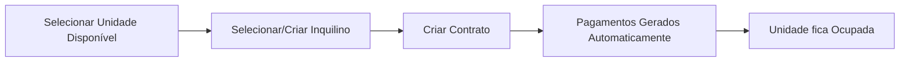
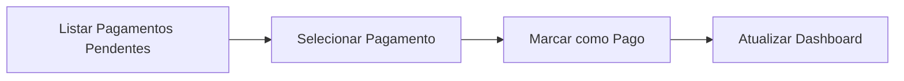
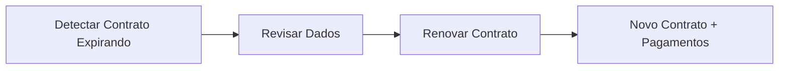

# Frontend Documentation - Kitnet Manager API

Documentação completa e concisa para desenvolvimento do frontend do **Kitnet Manager**.

---

## 📚 Estrutura da Documentação

```
frontend-docs/
├── README.md                  ← Você está aqui
├── API.md                     ← Guia rápido e visão geral
├── validation-rules.md        ← Regras de validação e lógica de negócio
├── types/                     ← TypeScript type definitions
│   ├── auth.ts
│   ├── unit.ts
│   ├── tenant.ts
│   ├── lease.ts
│   ├── payment.ts
│   └── dashboard.ts
└── endpoints/                 ← Documentação detalhada dos endpoints
    ├── auth.md
    ├── units.md
    ├── tenants.md
    ├── leases.md
    ├── payments.md
    └── dashboard.md
```

---

## 🚀 Quick Start

### 1. Leia Primeiro
- **[API.md](./API.md)** - Visão geral, autenticação, exemplos práticos
- **[validation-rules.md](./validation-rules.md)** - Regras de validação e negócio

### 2. Copie os Types
Todos os types TypeScript estão prontos em **[types/](./types/)**:
- Copie para seu projeto Next.js em `@/types/api/`
- Importe onde necessário

### 3. Implemente os Endpoints
Use a documentação em **[endpoints/](./endpoints/)** como referência:
- Request/Response schemas
- Exemplos reais
- Casos de erro

---

## 🔑 Informações Essenciais

### Base URL
```
https://kitnet-manager-production.up.railway.app/api/v1
```

### Autenticação
```typescript
headers: {
  'Authorization': 'Bearer {token}',
  'Content-Type': 'application/json'
}
```

### Credenciais Padrão
```
username: admin
password: admin123
```

### Swagger UI
```
https://kitnet-manager-production.up.railway.app/swagger/index.html
```

---

## 📖 Documentação por Módulo

### Authentication
- **Arquivo:** [endpoints/auth.md](./endpoints/auth.md)
- **Types:** [types/auth.ts](./types/auth.ts)
- **Endpoints principais:**
  - `POST /auth/login` - Login
  - `GET /auth/me` - Usuário atual
  - `POST /auth/refresh` - Renovar token

### Units (Unidades)
- **Arquivo:** [endpoints/units.md](./endpoints/units.md)
- **Types:** [types/unit.ts](./types/unit.ts)
- **Endpoints principais:**
  - `GET /units` - Listar unidades
  - `POST /units` - Criar unidade
  - `GET /units/stats/occupancy` - Estatísticas

### Tenants (Inquilinos)
- **Arquivo:** [endpoints/tenants.md](./endpoints/tenants.md)
- **Types:** [types/tenant.ts](./types/tenant.ts)
- **Endpoints principais:**
  - `GET /tenants` - Listar inquilinos
  - `POST /tenants` - Criar inquilino
  - `GET /tenants/cpf?cpf=XXX.XXX.XXX-XX` - Buscar por CPF

### Leases (Contratos)
- **Arquivo:** [endpoints/leases.md](./endpoints/leases.md)
- **Types:** [types/lease.ts](./types/lease.ts)
- **Endpoints principais:**
  - `GET /leases` - Listar contratos
  - `POST /leases` - Criar contrato (gera pagamentos automaticamente)
  - `POST /leases/:id/renew` - Renovar contrato
  - `POST /leases/:id/cancel` - Cancelar contrato

### Payments (Pagamentos)
- **Arquivo:** [endpoints/payments.md](./endpoints/payments.md)
- **Types:** [types/payment.ts](./types/payment.ts)
- **Endpoints principais:**
  - `GET /leases/:id/payments` - Pagamentos de um contrato
  - `PUT /payments/:id/pay` - Marcar como pago
  - `GET /payments/overdue` - Pagamentos atrasados
  - `GET /payments/upcoming` - Próximos vencimentos

### Dashboard & Reports
- **Arquivo:** [endpoints/dashboard.md](./endpoints/dashboard.md)
- **Types:** [types/dashboard.ts](./types/dashboard.ts)
- **Endpoints principais:**
  - `GET /dashboard` - Métricas consolidadas
  - `GET /reports/financial` - Relatório financeiro
  - `GET /reports/payments` - Histórico de pagamentos

---

## 🎯 Fluxos Principais

### 1. Criar Novo Contrato



**Endpoints:**
1. `GET /units?status=available`
2. `POST /tenants` ou `GET /tenants`
3. `POST /leases`

### 2. Processar Pagamento



**Endpoints:**
1. `GET /payments/upcoming` ou `GET /leases/:id/payments`
2. `PUT /payments/:id/pay`
3. `GET /dashboard`

### 3. Renovar Contrato



**Endpoints:**
1. `GET /leases/expiring-soon`
2. `POST /leases/:id/renew`

---

## 📋 Regras de Negócio Importantes

### Contratos (Leases)
- ✅ Duração fixa de **6 meses**
- ✅ Unidade deve estar `available`
- ✅ Inquilino não pode ter contrato ativo
- ✅ Pagamentos gerados automaticamente

### Pagamentos (Payments)
- ✅ Status: `pending` → `overdue` (automático após vencimento)
- ✅ Status: `pending/overdue` → `paid` (manual)
- ✅ Taxa de pintura atualiza `painting_fee_paid` no contrato
- ✅ Multa: 2% fixo + 1% juros ao mês (pro-rata diário)

### CPF
- ✅ Formato obrigatório: `XXX.XXX.XXX-XX`
- ✅ Único no sistema
- ✅ Não pode ser alterado após criação

### Unidades (Units)
- ✅ `current_rent_value` calculado baseado em `is_renovated`
- ✅ Status muda automaticamente ao criar/cancelar contrato
- ✅ Não pode deletar se `status = occupied`

---

## 🛠️ Utilitários para Frontend

### Validação de CPF
```typescript
const validateCPF = (cpf: string): boolean => {
  const cpfRegex = /^\d{3}\.\d{3}\.\d{3}-\d{2}$/
  if (!cpfRegex.test(cpf)) return false
  const digits = cpf.replace(/[.\-]/g, '')
  return digits.length === 11
}
```

### Formatação de Moeda
```typescript
const formatMoney = (value: string | number): string => {
  const num = typeof value === 'string' ? parseFloat(value) : value
  return new Intl.NumberFormat('pt-BR', {
    style: 'currency',
    currency: 'BRL'
  }).format(num)
}
```

### Cálculo de Multa
```typescript
const calculateLateFee = (amount: number, daysOverdue: number) => {
  const penalty = amount * 0.02
  const monthlyInterest = amount * 0.01
  const dailyInterest = monthlyInterest / 30
  const interest = dailyInterest * daysOverdue

  return {
    penalty,
    interest,
    total: penalty + interest
  }
}
```

### Cliente API Axios
```typescript
import axios from 'axios'

const api = axios.create({
  baseURL: 'https://kitnet-manager-production.up.railway.app/api/v1',
  headers: {
    'Content-Type': 'application/json'
  }
})

// Interceptor para adicionar token
api.interceptors.request.use(config => {
  const token = localStorage.getItem('token')
  if (token) {
    config.headers.Authorization = `Bearer ${token}`
  }
  return config
})

// Interceptor para tratar erros
api.interceptors.response.use(
  response => response.data,
  error => {
    if (error.response?.status === 401) {
      localStorage.removeItem('token')
      window.location.href = '/login'
    }
    return Promise.reject(error.response?.data || error)
  }
)

export default api
```

---

## 🎨 Sugestões de UI/UX

### Dashboard
- **Cards principais:** Ocupação, Receita Mensal, Pagamentos Pendentes, Alertas
- **Gráficos:** Taxa de ocupação (pizza), Receita por mês (linha)
- **Tabela:** Próximos vencimentos (7 dias)
- **Alertas:** Com badges de severidade (high=vermelho, medium=amarelo, low=azul)

### Listagens
- **Filtros:** Status, andar, inquilino, período
- **Busca:** Nome do inquilino, número da unidade
- **Paginação:** 20 itens por página
- **Ações rápidas:** Ver detalhes, editar, deletar

### Formulários
- **Validação em tempo real**
- **Máscaras:** CPF, telefone, valores monetários
- **Feedback visual:** Campos válidos/inválidos
- **Confirmação:** Para ações destrutivas (deletar, cancelar)

### Notificações
- **Success:** Verde com ícone de check
- **Error:** Vermelho com mensagem clara
- **Warning:** Amarelo para alertas
- **Info:** Azul para informações

---

## 📊 Estatísticas e Métricas

### Dados Disponíveis
- Taxa de ocupação geral e por andar
- Receita mensal prevista vs realizada
- Inadimplência (valor e quantidade)
- Contratos expirando (próximos 45 dias)
- Pagamentos atrasados (valor, dias de atraso)
- Unidades em manutenção

### Sugestões de KPIs
```typescript
const kpis = {
  occupancyRate: (occupied / total) * 100,
  collectionRate: (received / receivable) * 100,
  avgDaysOverdue: totalDaysOverdue / overdueCount,
  renewalRate: (renewed / expiring) * 100
}
```

---

## ⚡ Performance

### Recomendações
1. **Cache** com React Query ou SWR
2. **Debounce** em buscas (300ms)
3. **Paginação** para listagens grandes
4. **Otimistic Updates** para melhor UX
5. **Lazy Loading** de componentes pesados

### Intervalos de Atualização
```typescript
const REFRESH_INTERVALS = {
  dashboard: 60_000,     // 1 minuto
  alerts: 30_000,        // 30 segundos
  payments: 120_000,     // 2 minutos
  lists: 300_000         // 5 minutos
}
```

---

## 🔐 Segurança

### Checklist
- [ ] Token JWT armazenado de forma segura
- [ ] Logout limpa token e redireciona
- [ ] Refresh token antes de expirar
- [ ] Validação client-side + server-side
- [ ] Sanitização de inputs
- [ ] HTTPS obrigatório
- [ ] Não expor dados sensíveis em logs

---

## 📱 Responsividade

### Breakpoints Sugeridos
```typescript
const breakpoints = {
  mobile: '640px',
  tablet: '768px',
  desktop: '1024px',
  wide: '1280px'
}
```

### Prioridades Mobile-First
1. Login e dashboard
2. Lista de unidades/inquilinos
3. Pagamentos pendentes
4. Criar/editar registros

---

## 🧪 Testes

### Cenários Importantes
- [ ] Login com credenciais válidas/inválidas
- [ ] Criar contrato e verificar pagamentos gerados
- [ ] Renovar contrato próximo ao vencimento
- [ ] Marcar pagamento como pago
- [ ] Validação de CPF duplicado
- [ ] Cancelar contrato e verificar status da unidade
- [ ] Filtros e buscas funcionando
- [ ] Paginação e ordenação

---

## 📞 Suporte

- **Swagger:** https://kitnet-manager-production.up.railway.app/swagger/index.html
- **Health Check:** https://kitnet-manager-production.up.railway.app/health

---

## 🎓 Próximos Passos

1. ✅ Clone os types TypeScript
2. ✅ Configure cliente API (Axios/Fetch)
3. ✅ Implemente autenticação
4. ✅ Crie pages do Next.js
5. ✅ Desenvolva componentes reutilizáveis
6. ✅ Integre com React Query/SWR
7. ✅ Implemente validações
8. ✅ Adicione testes
9. ✅ Deploy!

---

**Documentação gerada em:** 2025-01-15
**Versão da API:** 1.0.0
**Frontend Target:** Next.js 14+ com TypeScript
